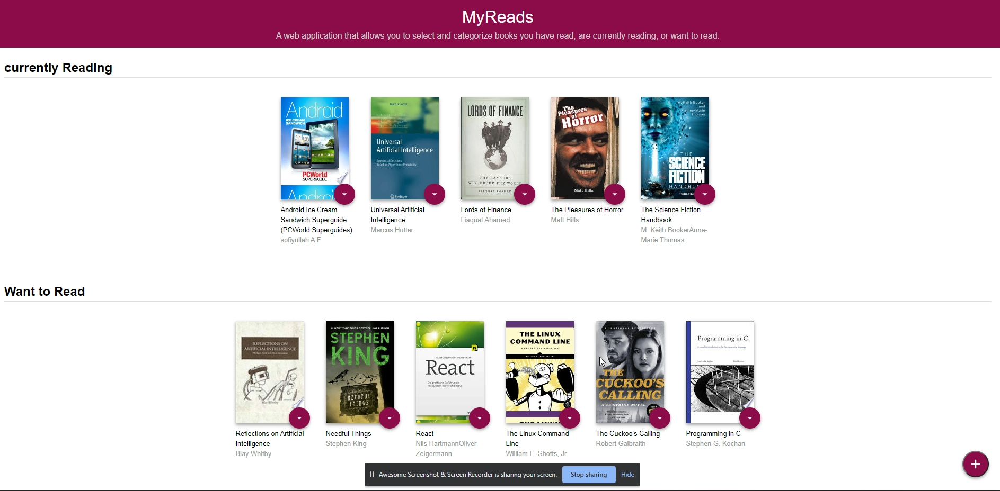

# MyRead --A Book lending app

 MyReads project is a web application that allows you to select and categorize books you have read, are currently reading, or want to read.
 
It also allow you to search for books based on title and author.




This app is the first of three projects required for [Udacity's React Nanodegree program](https://classroom.udacity.com/nanodegrees/nd019).
REACT FUNDAMENTAL PROJECT 1


 ## Check Live version [click here](https://myreadnd.netlify.app/)


## Built With

- HTML, CSS , JAVASCRIPT
- Framework - REACT
- REACT.JS


## Getting Started

Clone the repository, change directories, and use NPM to install the dependencies.

```bash
$ git clone https://github.com/Precioussoul/MyRead----Book-lending-App-React-Nd.git
$ cd MyRead----Book-lending-App-React-Nd
$ npm install
```
## Usage

The project can be run with

- `npm start`


## Author

👤 **Sofiyullah abdullah**

- GitHub: [@githubhandle](https://github.com/Precioussoul)
- Twitter: [@twitterhandle](https://twitter.com/Codedrill1)
 
## Acknowledgments


react doc
classroom
lectures video rewatch
Thinking in React
Youtube 

